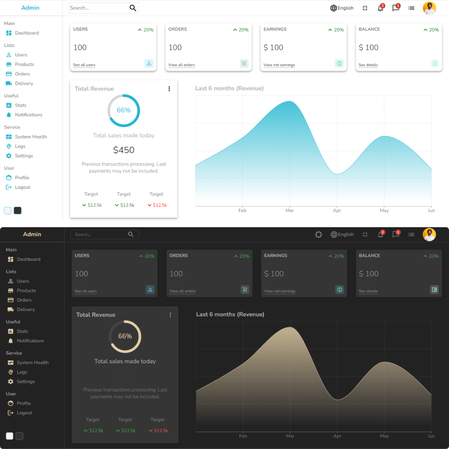

<p align="center" width="100%">
  
</p>

## About the project

That's a great project for people who's trying to improve their design skills. 
You can easily integrate your own database and manage the users and products from there. 


<p align="center" width="100%"> 
  
</p>

## Installation

1. Clone the repo

   ```
   git clone https://github.com/AmauriMarcos/React-Admin.git
   ```

2. Install NPM packages

   ```
   npm install
   ```
   
3. Go to the project folder

   ```
    cd React-Admin
   ```

4. Start the project

   ```
   npm start
   ```

## References

  I would like to say  <strong>Thank You</strong> to LamaDev. 
  He is helping me and others to improve as web developers. The React-Admin is one of his many projects and I glad that I went
  througt it because I've learned a lot. Cheers man ! 
